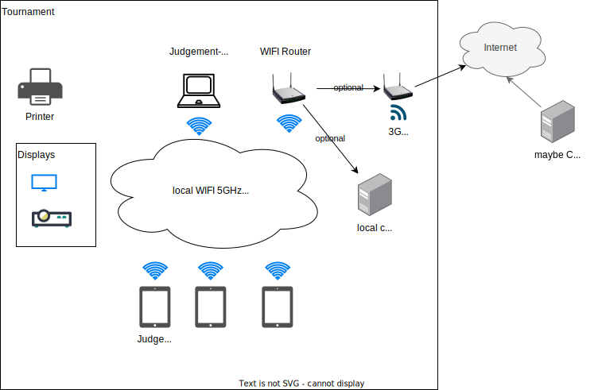
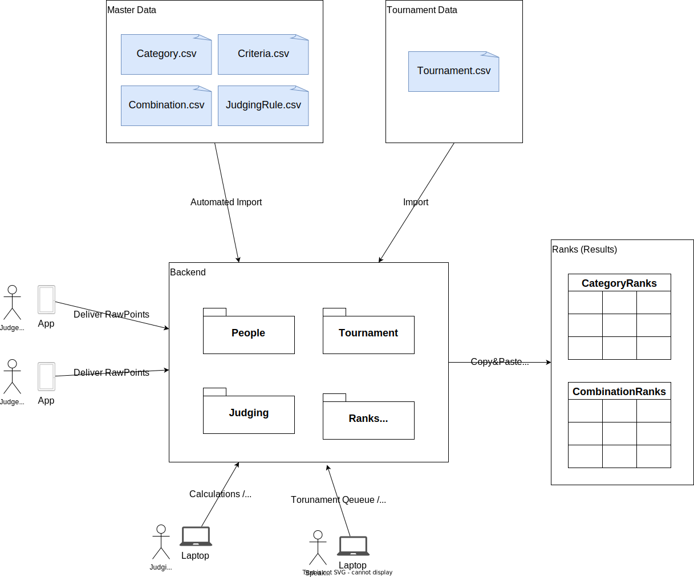
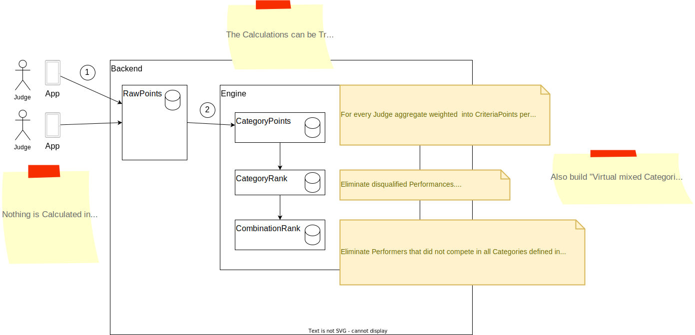

# System Architecture

## Hardware Setup

- Wireless (5 GHz)
- Tablets for Judges
- Notebook / Tablet for Speaker, Judgment-Office
- Monitors / Beamer for Spectators

## Domain Map

## Entity Relationship Diagram

## System Overview

## Calculation High Level Flow

