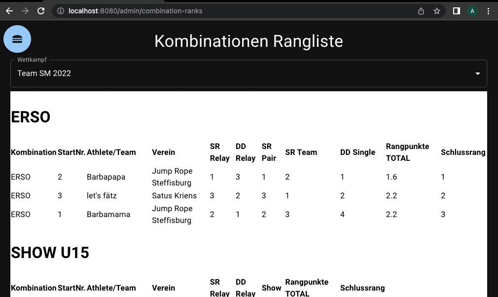
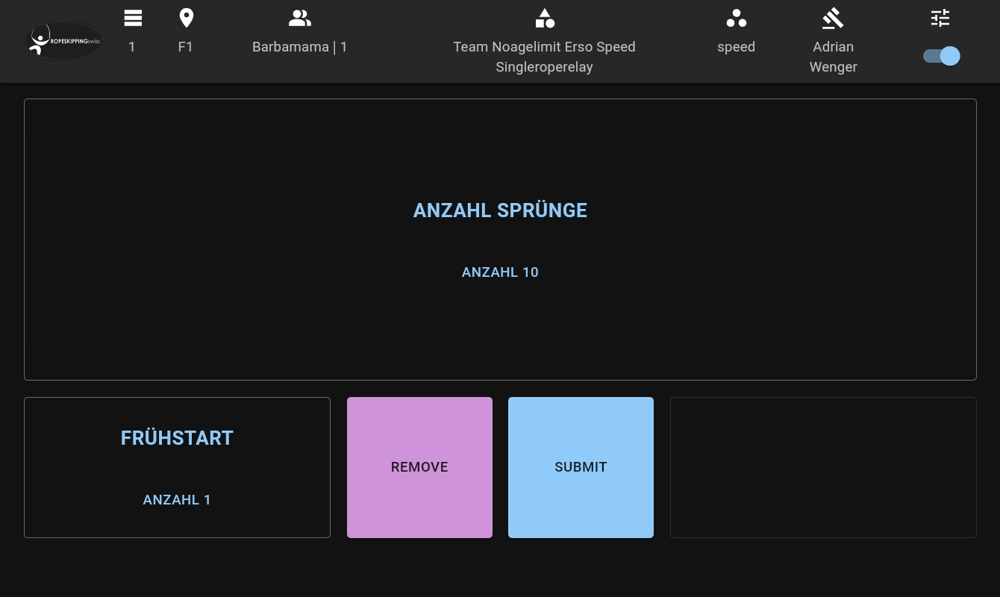

# Competition

> The Competition System can be used to manage sports tournament with sophisticated judging criterias like e.g. rope skipping, gymnastics, roller skating, different sort of freestyle performances etc.

## which problems does it solve

- fully digitalized tournament judgement
- plan tournament
- execute tournament
- judge performers/performances
- create points/ranks reports
- generate UI based on predefined criteria
- automated tests to verify correctness of results

## further documentation links

- [requirements (DE)](./REQUIREMENTS.md)
- [architecture](./ARCHITECTURE.md)
- [technology](./TECHNOLOGY.md)
- [backend](./backend/README.md)
- [frontend](./frontend/README.md)
- [data management (input data)](./DATA_MANAGEMENT.md)

## impressions

Here are some impressions

| Description | Impression |
| --- | --- |
| Calculation Engine |  |
| Administration Overview |  |
| Choose Judgement Criteria |  |
| Tournament Dashboard |  |
| Administration Calculation |  |
| Category Ranks |  |
| Combination Ranks |  |
| App: Judge Criteria Speed |  |
| App: Judge Criteria Creativity |  |
| App: Judge Criteria Presentation |  |

## license

[MIT](LICENSE.md)

## contact

If this system is helpful for you or if you have any Questions / Requests, please let us know: andi.neck@intesso.com

## sponsor

this project is sponsored by: [intesso](http://intesso.com)

